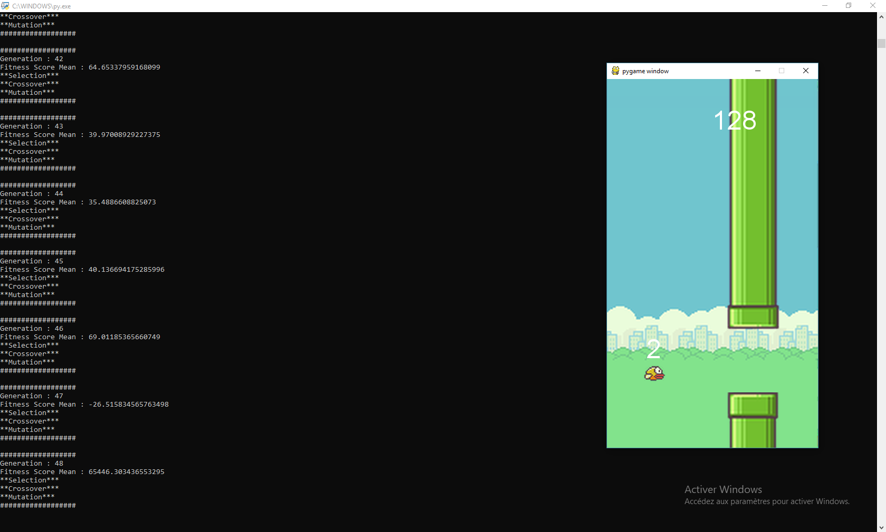
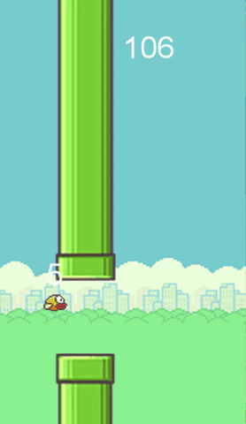
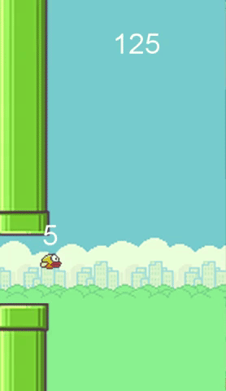

# The AI able to beat FlappyBird's World Record.

Hello, My name is Axel Hippolite and I am 17 years old :boy:. I wrote a course on medium about Machine Learning and more specifically about neural networks. To illustrate my point, I decided to code an AI capable of playing the famous FlappyBird game and beat its world record :trophy:.

Before continuing, take a look at the article in question to better understand the rest : https://link.medium.com/7jAujONtcZ. You can also put a few stars :star2: right at the top of this page if you like my work !

After completing all your tasks as good web citizens, you just have to download and extract all the files from the *.zip* then launch "FlapPyBirdAI.py" and arrange the windows this way : 

During the first generations of the population, the sweet birds will not pass any pair of obstacles but will become, however, as time goes by, more and more efficient until they reach this point :

The evolution is clear, sharp and clear. However, if we want to push the limits of our algorithm, we can increase the value of the *self.wallx* variable which increases the scrolling speed of the obstacles. By adjusting the variables *self.gravity* and *self.jumpSpeed* which define the intensity of gravity and the height of jump respectively, we can achieve a very impressive result :muscle: :

This is now the end of this repository, if you liked it, it's time to put some stars to it just at the top of this page and if you want to support me you can follow me on :point_right: Twitter (@AxelHippolite), :point_right:
Medium (https://medium.com/inov-lab) and :point_right: Instagram (axel_hpplt).

Thank you :pray::heart:.
